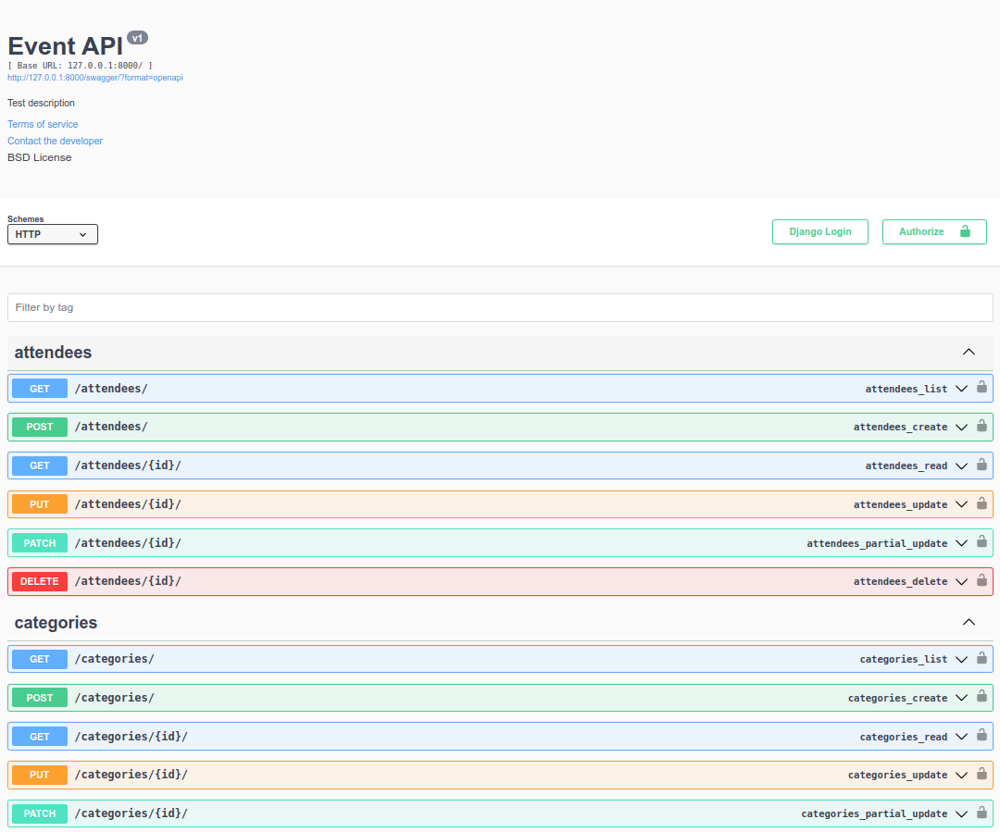
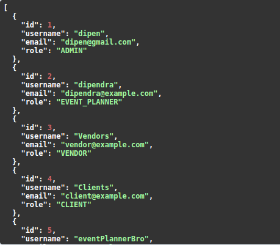
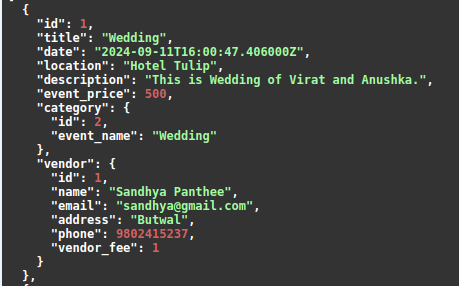
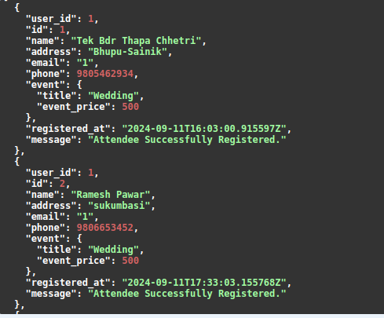
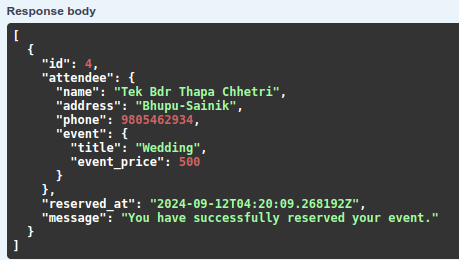
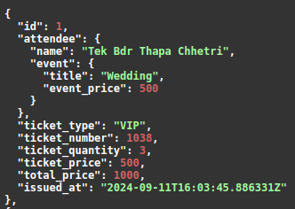
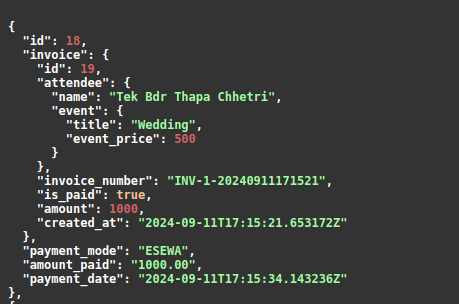
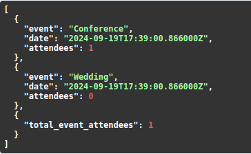

# Event Management System

### 📋 Table of Contents

- [Key Features](#-key-features)
- [Installation](#-installation)
- [Usage](#-usage)
- [Screenshots](#-screenshots)
- [Contributing](#-contributing)
- [Contact](#-contact)

### 🌟 Key Features

- **CRUD** – User can Create, Read, Update and Delete events based on permissions.
- **Roles** - Roles are given to the user so that user can get access to the system according to the roles given to the user.
- **Permissions** – Permissions are given to user based on the roles of the user i.e.
  - Admin - It is superuser and has access to the whole system.
  - Event Planner - They are responsible for handling and creating events.
  - Vendor - They can register vendor and assign them to the particular events.
  - Client - They are mainly responsible for registering users, book events, handles ticketing and payment.
- **Emails** - Sending mail facility is also implemented in this project i.e if user forgots password or after user is created mail is send to that particular user.
- **Expenses** - Each event fees, transportation fees, catering fees, vendor fees and equipment fees are given so the total expenses are generated and is visible to the user.
- **Reviews** - Attendees are allowed to review and give feedback of that event which they have participated.
- **Reports** - ADMIN can view the total revenue, attendee report and vendor performance of the particular event.
- **Documentation** - Swagger is used for documenting the API.
- **All the fetures related to event management system is implemented in this project like catering system, transportation, ticketing, reservations and many more.**
  
### 📦 Installation

To install this project, follow the steps below:
1. Clone the repository
```
git clone https://github.com/Dipen100/Event-Management-System.git
```
2. Navigate to the project directory
```
cd Event-Management-System
```

### 🛠️ Usage

Here's how to get started with the project:
1. Create the virtual environment
```
python3 -m venv .venv
```

2. Activate the virtual environment
```
source .venv/bin/activate
```

3. Install the necessary dependencies in the virtual environment
```
pip3 install -r requirements.txt
```

4. Run the server
```
python3 manage.py runserver
```
### 🎨 Screenshots
Screenshots are of homepage, types of user, event, attendees, reservations, ticketing, receipt and total attendees attended in events respectively.
<div style="display: flex; justify-content: space-around;">
  
  
  
  
  
  
  
  
</div>

### 🤝 Contributing
you are welcome to contribute to this project! Here's how you can contribute:

1. Fork the repo and create your branch:
```
git checkout -b (branch-name)
```
2. Commit your changes:
```
git commit -m 'first commit'
```
3. Push to the branch:
```
git push origin (branch-name)
```

## 💬 Contact
If any queries, please reach out:
  - Name: Dipendra Thapa Chhetri
  - Email: dipenthapachhetri10@gmail.com
  - GitHub: https://github.com/Dipen100

